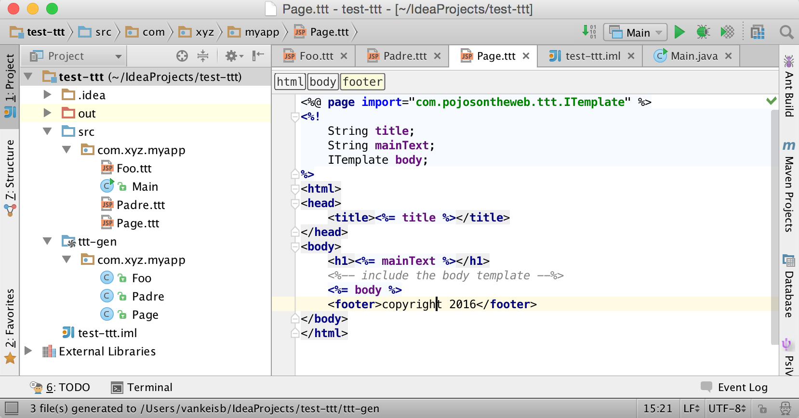
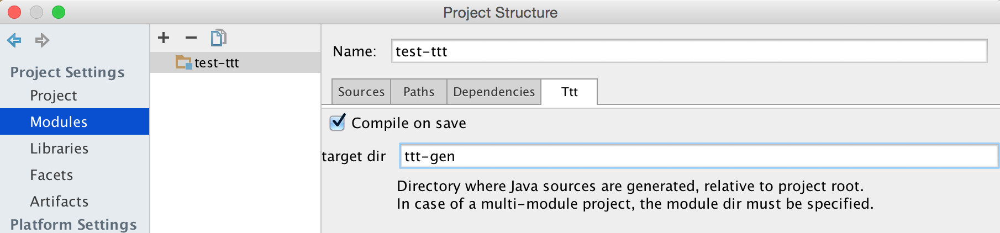
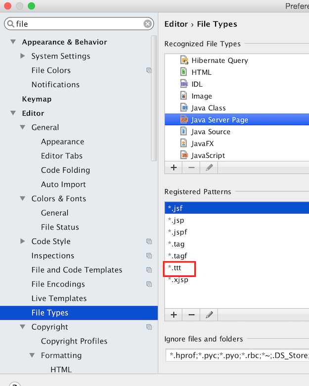

# TTT IntelliJ IDEA Plugin

The [ttt-idea](https://plugins.jetbrains.com/plugin/7880?pr=idea) plugin currently provides :
* compile action
* auto-compile TTT templates on save

## How To

First install the plugin from the JetBrains repo. 

Then, configure the plugin for the module paths in the `Module Settings` page, under the `Ttt` tab :

> You need to create a "generated sources" folder for the generated Java code. You can create 
> it anywhere you want, but it has to be present and marked as "generated sources folder"
> for the plugin to work.

Now, associate the `.ttt` files to the JSP editor :

You're done. You can explicitly invoke the "Tools -> TTT Compile" action, or just compile
on save.

> NOTE : the plugin is still a bit shaky, and sometimes doesn't refresh the files correctly.
> In that case you need to force the refresh manually (Synchronize action).
